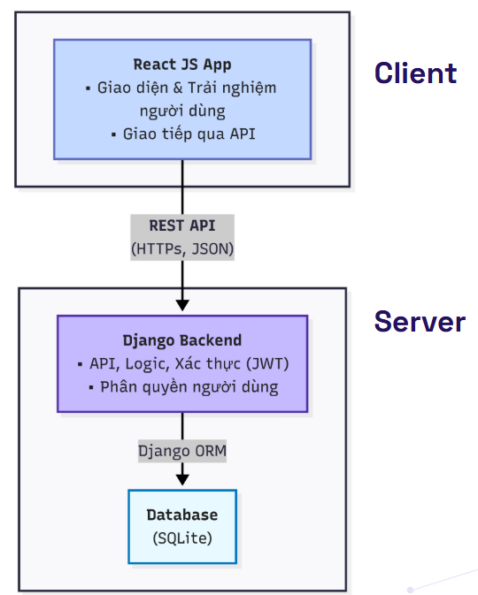

# SE104 - Final Project: Private Clinic Management System

This is a university project for the "Introduction to Software Engineering" course. It is a comprehensive web application designed to streamline and automate the daily operations of a private medical clinic, replacing traditional paper-based methods with a centralized, secure, and user-friendly digital solution.

## Team Members

This project was developed by:

| Name                            | Student ID | GitHub Profile                                       |
| :------------------------------ | :--------- | :--------------------------------------------------- |
| Dương Thị Tú Yến                | 23521846   | [@twoyens](https://github.com/twoyens)               |
| Nguyễn Mai Hảo                  | 23520446   | [@haohienhoa](https://github.com/haohienhoa)         |
| Trần Bảo Trân                   | 23521623   | [@tranbaotran216](https://github.com/tranbaotran216) |
| Dương Quốc Nhựt - siêu anti     | 23521132   | [@quocnhut134](https://github.com/quocnhut134)       |

## Table of Contents

- [Key Features](#key-features)
- [Tech Stack](#tech-stack)
- [System Architecture](#system-architecture)
- [Getting Started](#getting-started)
  - [Prerequisites](#prerequisites)
  - [Installation and Setup](#installation-and-setup)
- [Running Tests](#running-tests)

## Key Features

-   **Appointment Management**: Allows patients to book appointments online and staff to manage schedules.
-   **Patient Records**: Securely store and retrieve patient information and medical history.
-   **Medical Examinations**: Create digital examination forms, record diagnoses, and prescribe medication.
-   **Pharmacy Management**: Track medicine inventory, with automatic stock updates upon prescription.
-   **Billing & Invoicing**: Automatically calculate costs for consultations and medication, and generate invoices.
-   **Reporting**: Generate insightful reports on revenue and medicine usage.
-   **Based Access Control**: Different access levels for `Manager` and `Medical Staff` roles.

## Tech Stack

| Area             | Technology / Framework                                                                                                                                                                                                                                                                           |
| :--------------- | :----------------------------------------------------------------------------------------------------------------------------------------------------------------------------------------------------------------------------------------------------------------------------------------------- |
| **Backend**      |    |
| **Frontend**     |                                                                                   |
| **Database**     |  (for development)                                                                                                                                                                           |
| **API**          | RESTful API (JSON)                                                                                                                                                                                                                                                                               |
| **Authentication** | JSON Web Tokens (JWT)                                                                                                                                                                                                                                                                            |

## System Architecture

The system is designed with a modern **Client-Server** architecture, separating the frontend and backend for better scalability and independent development.




## Getting Started

Follow these instructions to get a copy of the project up and running on your local machine for development and testing purposes.

### Prerequisites

-   [Node.js](https://nodejs.org/) (v16.x or later)
-   [Python](https://www.python.org/) (v3.9 or later)
-   `pip` (Python package installer)
-   `venv` (for creating virtual environments)

### Installation and Setup

1.  **Clone the repository:**

    ```bash
    git clone https://github.com/your-username/your-repo-name.git
    cd your-repo-name
    ```

2.  **Setup the Backend (Django):**

    ```bash
    # Navigate to the backend directory
    cd backend

    # Create a virtual environment
    python -m venv venv

    # Activate the virtual environment
    # On Windows:
    .\venv\Scripts\activate
    # On macOS/Linux:
    source venv/bin/activate

    # Install required packages
    pip install -r requirements.txt

    # Create a .env file for environment variables
    # In the 'backend' directory, create a new file named '.env'
    # Add the following lines to it for email functionality (if any):
    # This is for using Gmail's SMTP server. You'll need to generate an App Password.
    EMAIL_HOST_USER=your_email@gmail.com
    EMAIL_HOST_PASSWORD=your_16_digit_app_password

    # Apply database migrations
    python manage.py migrate

    # Create a superuser to access the admin panel
    python manage.py createsuperuser

    # Start the backend server
    python manage.py runserver
    ```

    Your backend server will be running at `http://127.0.0.1:8000/`.

3.  **Setup the Frontend (React):**

    *Open a **new** terminal window.*

    ```bash
    # Navigate to the frontend directory from the project root
    cd frontend

    # Install dependencies
    npm install

    # Start the frontend development server
    npm start
    ```

    Your React application will automatically open in your browser at `http://localhost:3000/`.

## Running Tests

The project includes a suite of unit tests for the backend logic. To run them:

1.  Make sure you are in the `backend` directory with the virtual environment activated.
2.  Run the following command:

    ```bash
    python manage.py test
    ```
